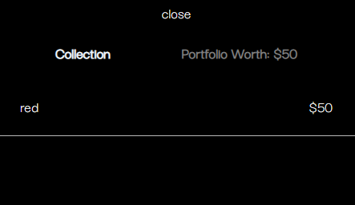

# Abstract-art.io

## A faux art exchange website.

[Click here](https://abstractartio.netlify.app/) to use the app

 

### Art pieces currently available for 'purchase'

- black
- white
- blue
- red
- green
- yellow
- purple

 

### Users

- username: john

- password: 1

or...

- username: eveleyn

- password: 1

 

### Quick guide

1. Log in with a username / password from above
2. Search for a art peice from the colors listed above
3. Click on the art piece you would like to buy
4. Check your portfolio by clicking on the menu arrow on the right side of the navbar and choosing 'collection'
5. When the 'collection' panel shows, click the art piece you would like to preview

 

 
 

### Deposit funds

1. After log in, go to the menu and click deposit funds.
2. Click 'deposit funds' and fill in the input value followed by clicking the depost funds button!

 

 
 

### Check Porfolio Worth

Your portfolio worth is shown in the collection tab as shown below.

 

 

 

### Current Functionality

- Log in with different users
- A user can take a closer look at their collection image upon purchase.
- Current worth of all art pieces the current user owns is shown in collection section.
- Show current free funds.
- Search for all art pieces and buy (if you have the funds). If not you can always deposit more funds!
- Free funds and current worth react dynamically to purchases
- App will only let users with an account to log in
- Log out returns the user to the log in page.
